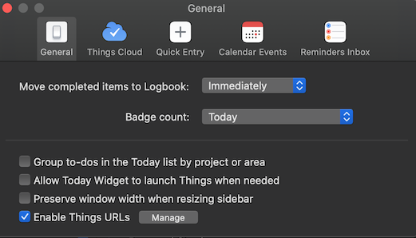
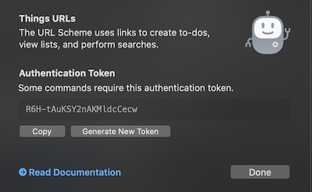
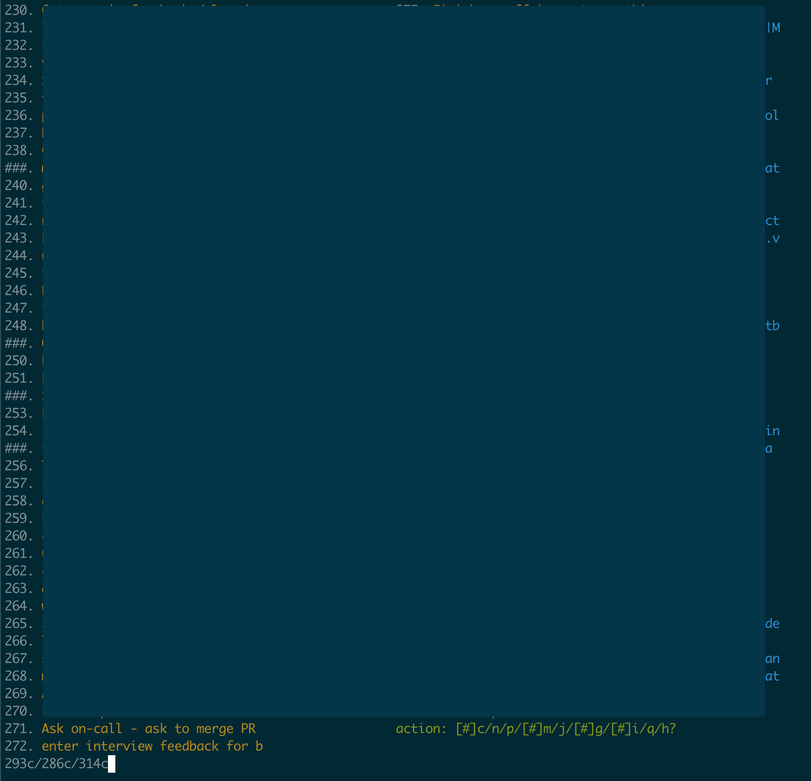

# things-patcher

## Prerequisites

- Requires the Things 3 [macOS
  app](https://apps.apple.com/us/app/things-3/id904280696?mt=12).
- Requires node.js installed.

## Installation

- 
- Enable Things URLs in Things.app Preferences...
- 
- And get the API key.
- Replace "R6H-tAuKSY2nAKMldcCecw" in run.js with your API key.
- Then install the one sqlite3 client dependency:

```
npm install || yarn
```

## Running

```
./run.js
```



It will prompt to enter commands.

- Note you can toggle how much is batched by
  entering: '+' or '-'
- The 'h' help keep gives more info about commands to enter
- You can enter multiple commands at once (e.g., 123c/127c for 'complete item 123 and
  complete item 127c'). Batching up input makes things go faster since each time
  you make updates it will need to switch the application context to the
  Things app (and then you can switch back).

## Known Issues

- When moving tasks to projects ("m" command), the project list that shows up includes only projects that already have tasks associated with them.
  Need to iterate on a better query for existing projects.
